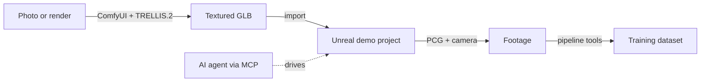

# Start Here — Replicate the Whole Stack

This vault is the **complete, verified build guide** for everything the course
machine runs: AI 3D generation (ComfyUI + TRELLIS.2), Unreal Engine with a
demo project, an MCP bridge that lets an AI agent drive the editor, and the
dataset pipeline tools. Every command here was actually executed and verified
on a real machine (RTX 4080 Laptop **12 GB**, Ubuntu, 2026-10-03; the
Unreal/MCP/PCG track re-verified on **Windows**, 2026-10-06) — including
the failure modes, which is why some steps look over-prescribed. They are.

## What you end up with

## Build order (do them in this order — each links the next)

| # | Do | Note | Time |
|---|----|------|------|
| 1 | Check your machine | [[01 Hardware and OS Requirements]] | 10 min |
| 2 | System setup (drivers, tools) | [[02 Linux System Setup]] or [[02 Windows System Setup]] | 20 min |
| 3 | Install ComfyUI | [[03 Install ComfyUI (Linux)]] or [[04 Install ComfyUI (Windows)]] | 30 min |
| 4 | Download TRELLIS.2 weights | [[05 TRELLIS.2 Model Weights]] | 30–90 min (network) |
| 5 | First 3D model, through the GUI | [[06 Your First 3D Model (GUI)]] | 30 min |
| 6 | (Advanced) drive it headless | [[07 Headless Generation and the API]] | 30 min |
| 7 | Install Unreal Engine | [[09 Install Unreal Engine (Linux)]] or [[09 Install Unreal Engine (Windows)]] | 1–2 h |
| 8 | Create the demo project + level — **or skip the build and clone it** (Git LFS, see §0) | [[10 Create the Demo Project]] | 30 min / 10 min + download |
| 9 | AI-agent ↔ editor bridge (MCP) | [[11 Unreal MCP Setup]] | 30 min |
| 10 | Dataset tools | [[13 Dataset Pipeline Tools]] | 15 min |
| — | City Sample (read first!) | [[12 City Sample on Linux — Reality Check]] | — |
| + | Extension: text→image→3D (SDXL) | [[16 Text to Image to 3D]] | 30 min |
| + | Extension: **agent builds modular PCG worlds** | [[17 Modular PCG via MCP]] | 45 min |

> [!important] Two standing caveats
> **Whenever anything breaks** read [[08 VRAM Playbook (12 GB and under)]] and
> [[14 Troubleshooting Field Guide]] **before** googling — 90 % of what will go
> wrong on a 12 GB card already happened to us and is written down.
> **Shell:** Linux snippets assume **bash**. On fish, first type `bash` (or use
> the fish-safe variants where marked) — fish rejects `VAR=value command`
> syntax. Windows twins ([[02 Windows System Setup]],
> [[09 Install Unreal Engine (Windows)]], [[04 Install ComfyUI (Windows)]]) are
> **PowerShell**.

## Reference folder
`template nodes/` — the whole pipeline explained **node by node**, mirroring
data flow: `text2img/` (SDXL input generation, optional upstream) →
`trellis/` (image→GLB). Start: [[00 Node Map]] (TRELLIS) or
[[00 Text2Image Node Map]] (SDXL).

## Final proof it all works
[[15 Verification Checklist]] — one page of commands, each with its expected
output. If every box ticks, your machine matches the course machine.
