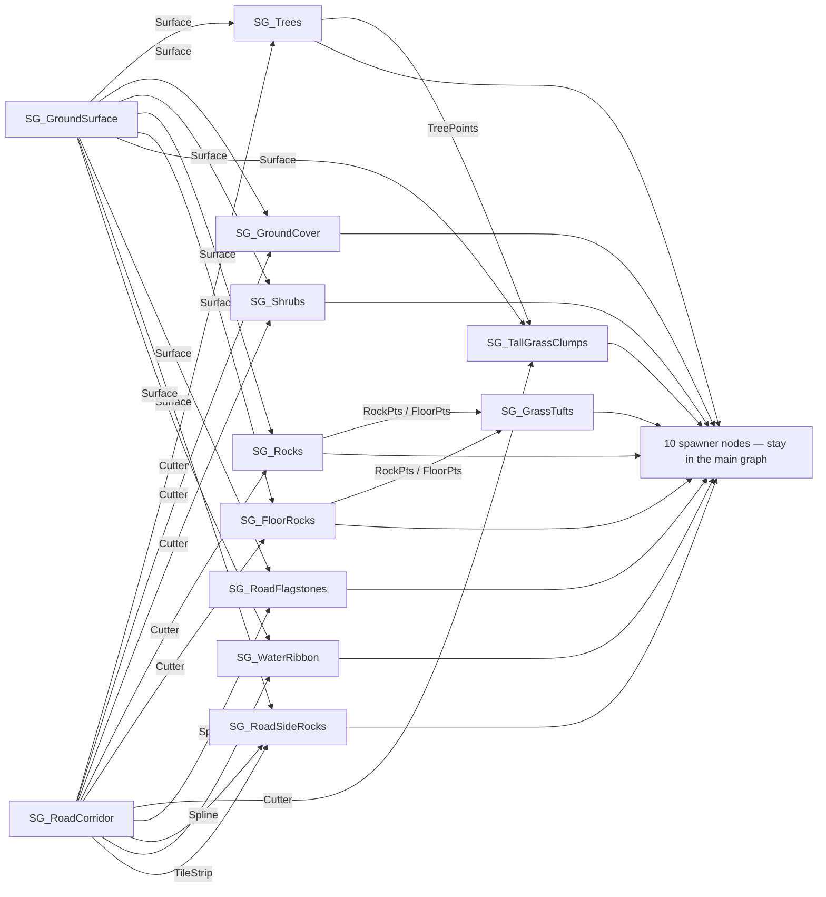

# Modular PCG, Built End-to-End via MCP

Turning **one 59-node PCG monolith** (`PCG_ScatterMesh`: trees, grass, shrubs,
rocks, road furniture all tangled) into a **12-subgraph module library + a thin
orchestrator**, then extending it with a water ribbon and grass-on-rocks —
with zero manual editor clicking, entirely through MCP tool calls
([[11 Unreal MCP Setup]]).

> [!note] Verified 2026-10-06 on the course laptop, **Windows** (UE 5.8)
> Project `VirtualWorldsDemo`, level `/Game/PCG_Map`, volume `ScatterVolume`.
> Final exec: 0 issues, all spawner "Added N instances" lines present.

## 1. Why modularize
A monolith graph can't be reused, reviewed, or tuned: "make grass clear the
road" meant hunting 6 Difference nodes scattered across 59. After the split,
each concern is an asset with **named typed pins** — e.g. the ground-surface
logic is now a one-node graph any other scatter graph can call.



## 2. Module library (`/Game/PCG/Subgraphs/`)

| Subgraph | Inputs | Outputs | Job |
|---|---|---|---|
| SG_GroundSurface | — | Surface | World-ray ground (ignores PCG hits), `ImpactNormal` |
| SG_RoadCorridor | — | Spline, Cutter, TileStrip | Reads spline actor tagged `RoadSpline`; 6.5 m cutters + 5.4 m flagstone strip |
| SG_Trees | Surface, Cutter | Conifers, Deciduous, TreePoints | 0.0065 pts/m², road-excluded, snapped, 50/50 species split via `SkinnedMeshPath` attribute tags |
| SG_TallGrassClumps | TreePoints, Surface, Cutter | Clumps | ×120 dup per tree, ±4.5 m scatter +2 m up, road-excluded, snapped |
| SG_GroundCover | Surface, Cutter | GrassPts | 10 pts/m² grass, tumbled, snapped, +18–35 cm above floor debris |
| SG_Shrubs | Surface, Cutter | ShrubPts | 0.035 pts/m², snapped, `SkinnedMeshPath` tag |
| SG_Rocks | Surface, Cutter | RockPts | 0.025 pts/m², embedded/spun/scaled |
| SG_FloorRocks | Surface, Cutter | FloorPts | 0.12 pts/m² small flat groups |
| SG_RoadFlagstones | Spline, Surface | StonePts | Slabs every 5.2 m, yaw = road tangent, tilt = ground normal, 2.5–4.5× scale |
| SG_RoadSideRocks | Spline, Surface, TileStrip | SideRockPts | Every 0.8 m, scattered ±8 m sideways, drops that land on tiles are cut |
| SG_WaterRibbon | Spline, Surface | WaterPts | See §6 |
| SG_GrassTufts | RockPts, FloorPts | TuftPts | See §7 |

The **main graph** keeps only: subgraph nodes ×13, spawner nodes ×10
(Static/Instanced Skinned Mesh Spawner), default in/out.

## 3. Rules that make PCG subgraphs modular

1. **Subgraphs emit points, never spawns.** Mesh-selection settings live in
   *inner sub-objects* of the spawner node
   (`…:SpawnRocks.PCGStaticMeshSpawnerSettings_1.PCGMeshSelectorWeighted_0`)
   that **cannot be carried across assets**. Spawners in the main graph keep
   them safe, and modules stay portable.
2. **Named typed pins** are set by rewriting the `pins` array on the default
   Input/Output nodes via `UpdateNode` (exact `FPCGPin` shape):
   ```json
   {"pins":[{"label":"Surface","usage":"Normal","allowedTypes":{"ids":[{"struct":{"refPath":"/Script/PCG.PCGDataTypeInfoSpatial"}}],"customSubtype":-1},"bAllowMultipleData":false,"pinStatus":"Normal","bInvisiblePin":false,"tooltip":"…","bAllowMultipleConnections":true}]}
   ```
   Use `/Script/PCG.PCGDataTypeInfoSpline` as the type id for spline pins.
3. **Expect boundary helper nodes.** `ConnectNodePins` auto-inserts
   `Filter Data By Type` / `Make Concrete` / `To Point` where data crosses
   subgraph edges (data loses its concrete/points flags at boundaries). Leave
   them in — they're the required conversions.
4. **Document every module** with `SetGraphDescription` — it shows up in the
   subgraph picker for the next person (and agent).

## 4. The MCP build loop (what actually gets called)
`GetGraphStructure` (read the old graph; its `paramOverrides` JSON re-applies
verbatim through `AddNode`) → `CreateGraph` ×N → `UpdateNode` (pins) →
`AddNode` / `ConnectNodePins` inside each module → `AddSubgraphNode` + wiring
in the main graph → `ExecuteGraphInstance` → verify (§8) → `save_assets`.
Batched 5–8 calls per round is safe: the game thread serializes them.

> [!tip] Backup trick before graph surgery
> ```powershell
> Copy-Item Content\PCG\PCG_ScatterMesh.uasset Content\PCG\PCG_ScatterMesh.bak
> ```
> Anything not ending `.uasset` is invisible to the asset registry — rename
> back to restore the pre-refactor graph.

## 5. Height-placement rules (the expensive lessons)
1. **Transform Points is point-local, additive, multiplicative**: offsets
   rotate with the point (no `bAbsoluteOffset`), rotations *add*, scales
   *multiply*. Free win: tufts duplicated from rocks inherit rock scale
   automatically.
2. **A downstream Projection overwrites the Z you just lifted.** First grass
   lift sat *before* `ProjGrass` and was silently erased — the lift node must
   come **after** projection.
3. **Any sideways move changes the ground beneath you.** Water tiles snapped
   on the road centerline vanished: the bank 4.5 m to the side is 0.6–0.9 m
   higher. Pattern that works:
   *sample → snap → orient → offset sideways → **re-snap → re-orient** → lift.*
4. **Same-run PCG collision is invisible to queries.** Rocks spawned in the
   current generation have no cooked physics yet (that's what the ground
   query's `bIgnorePCGHits` means). So "project grass onto rocks" via
   collision **cannot work in one pass** — derive points from the rock points
   instead (§7).

## 6. Water-ribbon recipe (fake water, real cheap)
`SG_WaterRibbon`: spline sampler @1.2 m (tangent attr `WaterDir`) → snap →
`Make Rotator Attribute` (`MakeRotFromXZ`, X=WaterDir, Z=ImpactNormal →
`$Rotation`) → offset Y +4.0–5.0 m (road-side, clear of the flagstones) →
**re-snap + re-orient at the bank** → lift +70–100 cm → spawner of engine
`Plane` ×1.3–1.45 with `M_WaterRibbon`.

**`M_WaterRibbon`** (`/Game/PCG/Materials/`): `blendMode` = `BLEND_Translucent`
· TexCoord → Panner (`speedX` 0.015, `speedY` 0.004) → Texture Sample
`/Water/Textures/Normals/T_Water_TilingNormal_With_Height_02_Softened`
(`samplerType` = `SAMPLERTYPE_Normal`) → Normal · dark-teal BaseColor ·
Roughness 0.08 · Opacity 0.82. Water-plugin materials (`Water_Material_River`)
need a Water Zone + water body — dead on arrival on a plain static mesh.

Spawner mesh + material: after `AddNode` with
`"meshSelectorType":"/Script/PCG.PCGMeshSelectorWeighted"`, point
`ObjectTools.set_properties` at the node's inner selector object:
`meshEntries[0].descriptor.staticMesh = /Engine/BasicShapes/Plane.Plane`,
`overrideMaterials = [M_WaterRibbon]`, `bCastShadow = false`.

## 7. Grass-on-rocks recipe
`SG_GrassTufts` skips collision entirely: duplicate each rock point
(×1 boulder / ×2 floor rock), lift to rock-top (+0.55–1.25 m / +20–45 cm,
local Z), jitter + tumble + small scale — multiplicative scaling makes tufts
grow with the rock. Output feeds the **existing** Short Wild Grass spawner
(its `In` pin takes a second connection — meshes stay shared).

## 8. Verify like we did (no eyeballing first)
1. `ExecuteGraphInstance` → empty issues array. `Failed to call Execute` right
   after edits = compile-cache race; retry once
   (log tell: `FPCGGraphCompilerCache::RemoveFromCache`).
2. `GetNodeDataView` on the suspect node, `endIndex:1–3`: check
   `$Transform.translation`, that attribute tags survived the boundary
   (`SkinnedMeshPath`, `WaterDir`, `ImpactNormal`).
3. **"I don't see it" = height bug, not spawn bug.** `SceneTools.trace_world`
   from +500 above the point's XY downward: if the hit Z is above the point Z,
   it's buried (this is exactly how the underwater "water" was caught).
4. Ground truth spawner counts: `LogsToolset.GetLogEntries` category `LogPCG`
   → one `Added N instances of '<mesh>'` line per spawner, per generation.
5. `GetNodeDataView` **times out on 100 k-point nodes** (161 k-point grass
   killed the MCP request). Inspect a smaller upstream node or use element
   ranges. Never run `ExecuteGraphInstance`/`GetNodeDataView` concurrently on
   two actors sharing a graph — freeze risk.

## 9. Tuning knobs

| Want | Touch |
|---|---|
| Water higher / lower | `SG_WaterRibbon → LiftWater` z |
| Water wider / denser | `SideOffset` scale / `WaterPts` `distanceIncrement` |
| Water further from road | `SideOffset` y (400–500) |
| Flow speed | `M_WaterRibbon` panner `speedX/Y` |
| Grass clear the floor rocks | `SG_GroundCover → LiftGrass` z (18–35) |
| Tufts per rock | `SG_GrassTufts` Dup nodes `iterations` |
| Vegetation density | each module's Surface Sampler `pointsPerSquaredMeter` |
| Road clearance | `SG_RoadCorridor → RoadCut` extents (650) |

## 10. Asset inventory
- `/Game/PCG/PCG_ScatterMesh` — orchestrator (13 subgraph nodes + 10 spawners)
- `/Game/PCG/Subgraphs/` — the 12 modules above, each with a description
- `/Game/PCG/Materials/M_WaterRibbon`
- `Content/PCG/PCG_ScatterMesh.bak` — pre-refactor backup (delete when happy)

Next: fold modules into new biomes → back to [[10 Create the Demo Project]],
or overall proof: [[15 Verification Checklist]]
