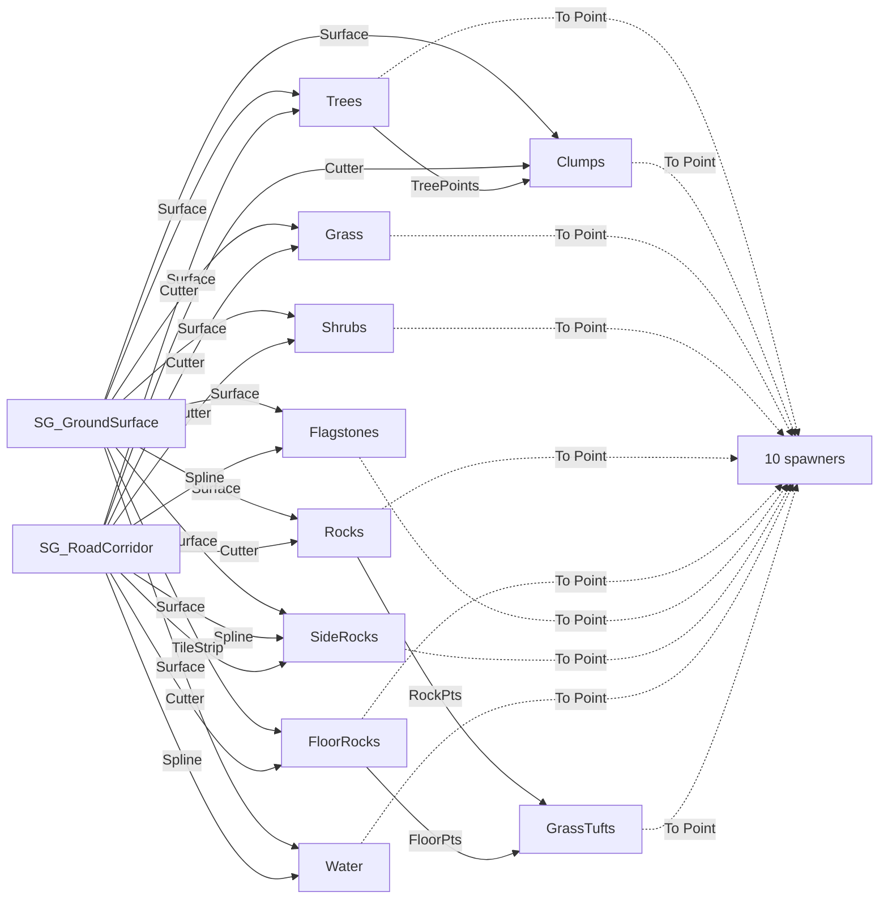

# PCG_ScatterMesh — Module Map

The **real** graph: `/Game/PCG/PCG_ScatterMesh`, run by `ScatterVolume` in
`/Game/PCG_Map`. 36 nodes = **13 subgraph calls + 11 To-Point + 10
spawners** (+I/O). How it was built via MCP: [[17 Modular PCG via MCP]].
What the node *types* do: [[00 PCG Learn Node Map|node reference]] — the
learn graph is this graph taken apart into teaching strips.

## Topology (live from the graph)

## Subgraph nodes → modules (live param values)

| Main-graph node | Module | Live settings that matter |
|---|---|---|
| `SubGraph_Ground` | SG_GroundSurface | World rays from +60 m, 150 m down, `bIgnorePCGHits`, `bGetImpactNormal` |
| `SubGraph_Road` | SG_RoadCorridor | spline tag `RoadSpline`; cutters `(650)³`; tile strip `(540)³`; 20 cm filter-chain |
| `SubGraph_Trees` | SG_Trees | `0.0065/m²`, extents `(325)³`; jitter ±1.8 m, scale 0.55–1.6; 50/50 split → Conifer/Deciduous tags |
| `SubGraph_Clumps` | SG_TallGrassClumps | ×120 per tree; ±4.5 m, +20 m up (pre-snap), scale 0.8–3.4 |
| `SubGraph_Grass` | SG_GroundCover | `10/m²`, tumble ±15°, lift **+18–35 cm AFTER snap** |
| `SubGraph_Shrubs` | SG_Shrubs | `0.035/m²`, ±1.2 m jitter, shrub `SkinnedMeshPath` |
| `SubGraph_Rocks` | SG_Rocks | `0.025/m²`, embed z −25…+10, scale 0.35–2.2 |
| `SubGraph_FloorRocks` | SG_FloorRocks | `0.12/m²`, flat groups scale 0.3–0.85 |
| `SubGraph_Flagstones` | SG_RoadFlagstones | slabs @ 520 cm, `RoadDir`×`ImpactNormal` rotator, scale 2.5–4.5 |
| `SubGraph_SideRocks` | SG_RoadSideRocks | candidates @ 80 cm, ±8 m scatter, TileStrip difference |
| `SubGraph_Water` | SG_WaterRibbon | 120 cm ribbon, side Y 400–500, **re-snap+re-orient at bank**, lift +70–100 |
| `SubGraph_Tufts` | SG_GrassTufts | 1 tuft/boulder (+55–125 cm), 2/floor rock (+20–45 cm) |

## Spawner column (all outputs converge here)

Every module output → `ToPoint_N` → spawner `In`. The spawner holds the
mesh/material settings — inner objects that can't live in subgraphs
([[nodes/Spawners (Static and Instanced Skinned)]]):

| Spawner | Kind | Mesh note |
|---|---|---|
| `SpawnPVEConifers` / `SpawnPVEDeciduous` / `SpawnPVEShrubs` | Instanced Skinned | read `SkinnedMeshPath` tags |
| `SpawnGrassTall` | Static | long ribbon grass |
| `SpawnGrassBase` | Static | **two inputs**: ground grass + rock tufts |
| `SpawnRocks` | Static | 17 variants, equal weight |
| `SpawnFloor` / `SpawnStones` / `SpawnSideRocks` | Static | floor groups / shrine slabs / garden rocks |
| `SpawnWater` | Static | `/Engine/BasicShapes/Plane` + `M_WaterRibbon`, no shadow |

## Data-flow invariants (why it's wired this way)

1. **One ground read** (`SubGraph_Ground.Surface`) fans to all 9 consumers —
   collision once ([[nodes/World Ray Hit Query]]).
2. **One road read** (`SubGraph_Road`) fans Cutter/Spline/TileStrip —
   authoring once ([[nodes/Get Spline Data]]).
3. **Modules never spawn**; **spawners never compute**
   ([[17 Modular PCG via MCP#3. Rules that make PCG subgraphs modular]]).
4. **Snap-then-lift, never lift-then-snap**
   ([[nodes/Projection]] rules; `LiftGrass`/`LiftWater` are last before out).
5. Water/flagstone orientation = tangent+normal rotator
   ([[nodes/Spline Sampler]] → [[nodes/Add Attribute]]).

> [!tip] Tuning
> The knob table (what to touch for "grass clear the road", "water higher"…)
> lives in [[17 Modular PCG via MCP#9. Tuning knobs]]. Teaching version of any
> mechanism: find the step in [[00 PCG Learn Node Map|PCG Learn]].
