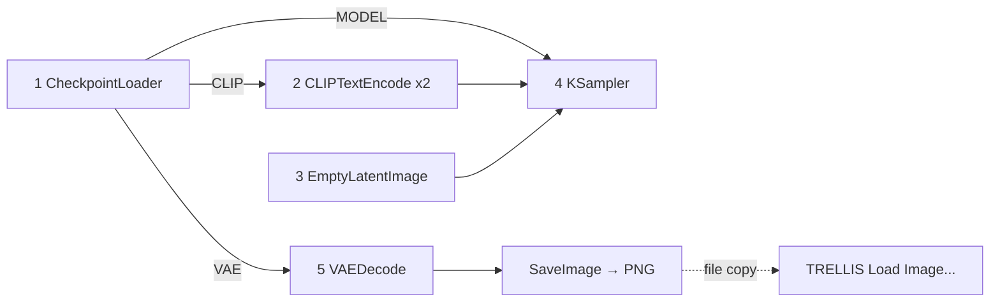

# Text→Image Node Map (upstream of TRELLIS)

The optional **front** of the pipeline ([[16 Text to Image to 3D]]): a plain
SDXL text-to-image graph whose **output picture becomes `LoadImage`'s input**
downstream in the TRELLIS half ([[00 Node Map]]). Five node classes — and
#4 is physics you already know from [[07 KSampler x4]].

## The graph (from the vault's verified
[[attachments/text2img_sdxl_api.json|text2img_sdxl_api.json]])

## Tour order

| # | File | Node class(es) | Role |
|---|---|---|---|
| 1 | [[01 CheckpointLoaderSimple]] | `CheckpointLoaderSimple` | loads model+encoders+VAE — one file |
| 2 | [[02 CLIPTextEncode x2]] | `CLIPTextEncode` ×2 | **the prompt** (this half's real dial) |
| 3 | [[03 EmptyLatentImage]] | `EmptyLatentImage` | canvas size — SDXL is picky |
| 4 | [[04 KSampler]] | `KSampler` | same physics as the 3D half, SDXL sweet spots |
| 5 | [[05 VAEDecode and SaveImage]] | `VAEDecode`, `SaveImage` | pixels out + the `input/` copy gotcha |

**Measured on the course laptop (12 GB, baseline flags):** ~6 GB VRAM peak,
1024²/28 steps in **~10 s** — the comfortable half of the day's pipeline.
The prompt that made the vault's example lamp lives in
[[16 Text to Image to 3D#The 3D-friendly prompt kit (what makes TRELLIS.2 happy)]] —
prompting *for good 3D inputs* is a note-16 topic, not a node topic.

Downstream: [[00 Node Map]] (TRELLIS half)
