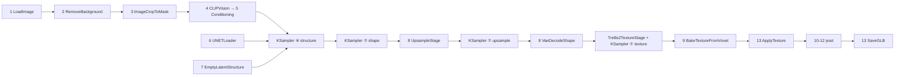

# The Template, Node by Node — Map

The official *Pixal3D & TRELLIS.2: Image to Model* template is 28 nodes on the
TRELLIS.2 path (plus the Pixal3D branch the switch hides). This folder explains
**every node and every widget: what it does and what you actually get when you
turn it** — with the defaults the template ships and the VRAM/time consequences
we measured on a 12 GB card (7 instrumented runs).

## The pipeline in one picture

## Tour order (each file = one station of the graph)

| # | File | Node class(es) | Stage |
|---|---|---|---|
| 1 | [[01 LoadImage]] | `LoadImage` | input |
| 2 | [[02 RemoveBackground]] | `LoadBackgroundRemovalModel`, `RemoveBackground` | input |
| 3 | [[03 ImageCropToMask]] | `ImageCropToMask` | input |
| 4 | [[04 CLIPVisionLoader and Trellis2Conditioning]] | `CLIPVisionLoader`, `Trellis2Conditioning` | conditioning |
| 5 | [[05 UNETLoader]] | `UNETLoader` | model |
| 6 | [[06 EmptyTrellis2LatentStructure]] | `EmptyTrellis2LatentStructure` | model |
| 7 | [[07 KSampler x4]] | `KSampler` ×4 | **diffusion (the heart)** |
| 8 | [[08 Trellis2 Stages and VaeDecodes]] | Shape/Upsample/Texture stages, 3 `VaeDecode*` | decode |
| 9 | [[09 BakeTextureFromVoxel]] | `BakeTextureFromVoxel` | texture |
| 10 | [[10 DecimateMesh]] | `DecimateMesh` | post |
| 11 | [[11 UnwrapMesh]] | `UnwrapMesh` | post |
| 12 | [[12 MeshSmoothNormals]] | `MeshSmoothNormals` ×2 | post |
| 13 | [[13 Export MeshToFile3D and SaveGLB]] | `ApplyTextureToMesh`, `MeshToFile3D`, `SaveGLB` | export |
| 14 | [[14 Switch and the Pixal3D Branch]] | switch + MoGe/camera nodes | branch |
| ⬆ | *Upstream half:* [[00 Text2Image Node Map]] | SDXL text→image front | generates this graph's input image ([[16 Text to Image to 3D]]) |

## The two dial tables (memorize these)

> [!success] Safe to turn on any machine
> | Dial | Effect | Cost |
> |---|---|---|
> | `seed` (any sampler) | new random shape from the same photo | time only |
> | `steps` 12→20–30 | refinement, strong effect on shape sampler | linear time |
> | `cfg` (shape samplers) | 7.5 → stricter photo adherence | none |
> | `target_face_count` (Decimate) | smaller GLB, lighter in UE | free (post!) |
> | `filename_prefix` | where the .glb lands | free |
> | `pad_factor` / `grow_mask` | silhouette framing | free |

> [!failure] Dangerous dials on ≤12 GB (measured)
> | Dial | Why |
> |---|---|
> | `target_resolution` (UpsampleStage) | **cubic** VRAM: 1024 = +2.5 GiB decode (fits), 1536/2048 = ~8.5/~20 GiB (OOM). Hard floor is 1024 — it will not go lower |
> | `batch_size` | ×N on *everything*, VRAM ×N. Keep 1 on laptops |
> | `texture_size` (Bake) | the liar — costs ≈4–10 GiB **regardless of the value** (512 cost MORE than 1024 in our runs). Bake itself is the 12 GB wall: see [[09 BakeTextureFromVoxel]] |
> | `UnwrapMesh.resolution` | 4096 UV atlas: fine with shape-only, don't add *more* to it while baking |

Full decision tree: [[08 VRAM Playbook (12 GB and under)]].

Start the tour: [[01 LoadImage]] →
